# 社内問い合わせ管理システム

## 現在のバージョン

現在の最新版は **Ver.2.0.0** です。

Ver.1では、問い合わせの受付、記録、進捗管理、期限超過判定、集計、Tableau連携用CSV出力を実装しました。
Ver.2では、Ver.1の機能に加えて、要対応アラート、FAQ候補管理、カテゴリ別入力フォーム、依頼者向け確認画面、Ver.2追加集計、Tableau出力列の拡張を追加しています。

## 概要

本プロジェクトは、社内の問い合わせ・依頼対応業務を効率化するための簡易DXアプリです。
従業員30名規模の架空企業「株式会社西日本アーバン設備」を題材に、管理部へ寄せられる社内問い合わせを一元管理する仕組みを作成しました。

Ver.1では、問い合わせの受付、記録、進捗管理、期限超過判定、集計、Tableau連携用CSV出力を実装しました。

Ver.2では、Ver.1の問い合わせ管理機能を拡張し、以下の機能を追加しています。これにより、問い合わせを記録・管理するだけでなく、問い合わせ削減や自己解決支援につながる仕組みへ発展させています。

- 要対応アラート
- FAQ候補管理
- カテゴリ別入力フォーム
- 依頼者向け確認画面
- Ver.2追加集計
- Tableau出力列の拡張

## 背景

DX化前は、社員からの問い合わせが以下のような複数経路で管理部に届いていました。

- 電話
- 口頭
- メール
- チャット
- Excel

そのため、以下の課題が発生していました。

| 課題               | 内容                                                                 |
| ------------------ | -------------------------------------------------------------------- |
| 受付経路の分散     | 問い合わせが複数経路に分かれ、所在が分かりにくい                     |
| 記録漏れ           | 電話・口頭の問い合わせが台帳に残らないことがある                     |
| 転記負担           | 管理部担当者がExcel台帳へ手作業で転記している                        |
| 進捗不明           | ステータス更新が後回しになりやすい                                   |
| 期限超過の見落とし | 未対応・期限切れ案件を目視で確認している                             |
| 報告作成負担       | 週次・月次報告のために手作業集計が必要                               |
| 属人化             | PC・システム、アカウント・権限関連の問い合わせが特定担当者に集中する |
| 確認往復の発生     | 初回問い合わせ時点で必要情報が不足し、追加確認が発生する             |
| 自己解決の不足     | よくある問い合わせがナレッジ化されず、同種の問い合わせが繰り返される |

## 目的

本システムの目的は、問い合わせ対応そのものを完全に自動化することではありません。
主な目的は、問い合わせ管理に伴う以下の作業を効率化することです。

- 問い合わせ内容の記録
- 担当者の設定
- ステータス管理
- 期限超過確認
- 対応内容の記録
- 件数集計
- Tableau用データ出力

Ver.2では、さらに以下を目的に追加しています。

- 要対応案件の見落としを減らす
- 完了済み問い合わせからFAQ候補を蓄積する
- カテゴリ別入力フォームにより確認往復を減らす
- 依頼者が問い合わせ状況を確認できるようにする
- Ver.2追加機能の利用状況を集計・可視化する

## 想定効果

DX化前の問い合わせ管理作業は、月約25時間と想定しました。
システム導入後は、管理作業時間を月約7時間まで削減することを想定しています。

| 項目                   |      DX化前 |      DX化後 |
| ---------------------- | ----------: | ----------: |
| 問い合わせ管理作業時間 | 約25時間/月 |  約7時間/月 |
| 削減時間               |           - | 約18時間/月 |
| 削減率                 |           - |       約70% |

この削減効果は、問い合わせ対応そのものではなく、転記、確認、進捗管理、期限確認、報告作成などの管理作業を対象としています。

Ver.2では、上記に加えて以下の効果を想定しています。

| 追加効果           | 内容                                                               |
| ------------------ | ------------------------------------------------------------------ |
| 対応漏れ防止       | 要対応アラートにより、期限超過や担当者未設定を見つけやすくする     |
| 確認往復の削減     | カテゴリ別入力フォームにより、初回問い合わせ時点で必要情報を集める |
| 問い合わせ削減     | FAQ候補管理により、頻出問い合わせのナレッジ化につなげる            |
| 進捗確認負担の削減 | 依頼者向け確認画面により、依頼者が状況を確認できるようにする       |
| 改善状況の可視化   | Ver.2追加集計とTableau出力により、改善状況を数値で確認する         |

## Before / After

| 観点       | DX化前                                    | Ver.1                          | Ver.2                                     |
| ---------- | ----------------------------------------- | ------------------------------ | ----------------------------------------- |
| 受付       | 電話・口頭・メール・チャット・Excelに分散 | フォーム登録に統一             | カテゴリ別入力フォームで必要情報も収集    |
| 記録       | Excel台帳へ手入力                         | SQLiteに一元保存               | FAQ候補・追加情報・依頼者表示フラグも管理 |
| 進捗管理   | Excelを目視確認                           | Streamlitで一覧・フィルタ確認  | 依頼者向け確認画面でも状況確認            |
| 期限超過   | 手作業・目視確認                          | 自動判定                       | 要対応アラートで優先確認                  |
| 集計       | Excelで手作業集計                         | Pythonで自動集計               | Ver.2追加機能も集計                       |
| 報告       | 手作業で週次・月次資料作成                | Tableau用CSVを出力し可視化     | Ver.2追加列をTableau出力に反映            |
| 属人化把握 | 担当者ごとの負荷が見えにくい              | 担当者別件数・作業時間を可視化 | アラート・FAQ候補・追加情報入力率も確認   |
| ナレッジ化 | 対応内容が個人に残りやすい                | 対応内容を記録                 | FAQ候補として蓄積                         |

## 主な機能

| 機能                   | 内容                                                                |
| ---------------------- | ------------------------------------------------------------------- |
| 問い合わせ一覧表示     | SQLiteに保存された問い合わせを一覧表示                              |
| 絞り込み               | 部署、カテゴリ、担当者、ステータス、優先度、期限超過で絞り込み      |
| 新規登録               | Streamlitフォームから問い合わせを登録                               |
| カテゴリ別入力フォーム | カテゴリに応じた追加項目を表示し、確認往復を削減                    |
| ステータス更新         | 担当者、ステータス、対応内容、完了日を更新                          |
| 期限超過判定           | 未完了かつ期限切れの案件を自動判定                                  |
| 要対応アラート         | 期限超過、本日期限、期限間近、担当者未設定、情報待ち長期化を表示    |
| FAQ候補管理            | 完了済み問い合わせからFAQ候補を登録・更新・解除                     |
| 依頼者向け確認         | 問い合わせIDまたは依頼者名で、依頼者が状況を確認                    |
| 集計                   | カテゴリ別、担当者別、ステータス別、受付経路別に集計                |
| Ver.2追加集計          | アラート件数、FAQ候補件数、追加情報入力率、依頼者向け表示件数を集計 |
| 作業時間集計           | 管理作業時間、実対応時間を集計                                      |
| Tableau連携            | Tableau用CSVを出力                                                  |
| テスト                 | スモークテスト、Ver.2スモークテスト、手動テストチェックリストを用意 |

## 画面例

### 要対応アラート

期限超過、本日期限、期限間近、担当者未設定、情報待ち長期化を自動判定し、優先的に確認すべき問い合わせを一覧表示します。

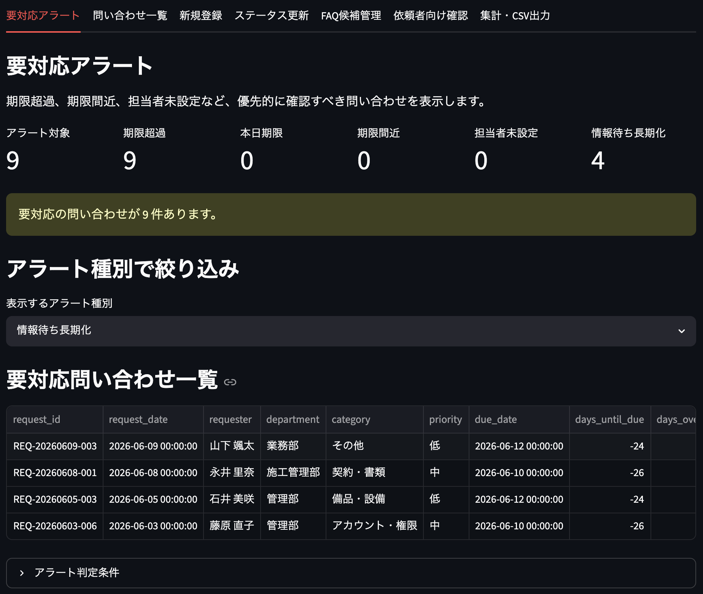

### 問い合わせ一覧

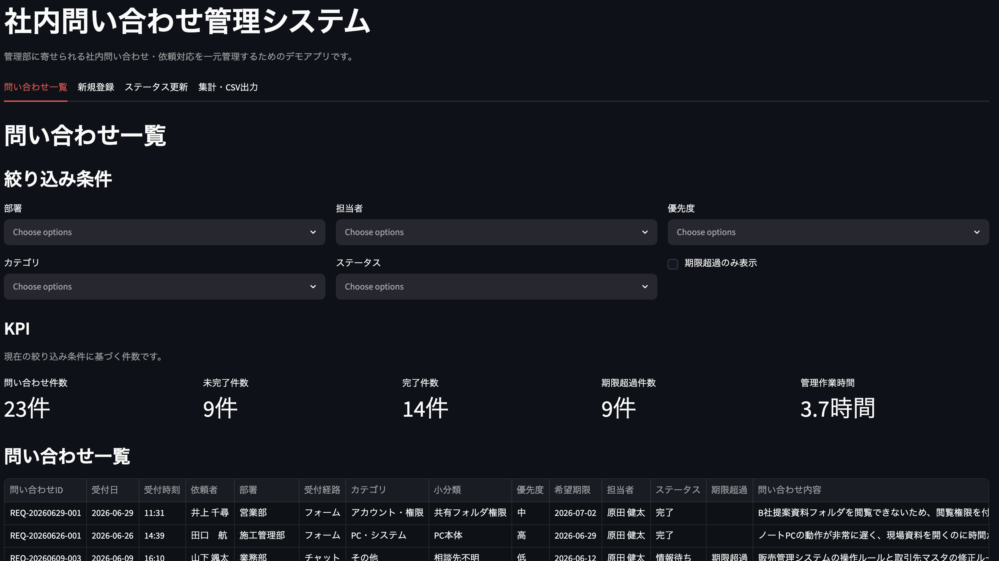

### 新規登録

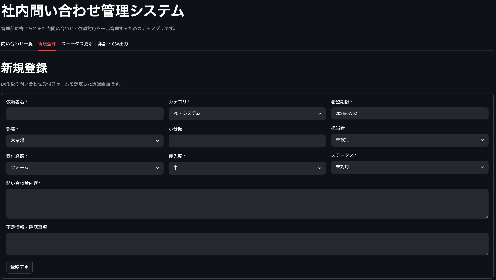

### カテゴリ別入力フォーム

問い合わせカテゴリに応じて、PC管理番号、対象日、金額、承認者などの追加項目を表示します。初回問い合わせ時点で必要情報を集め、確認往復を減らすことを目的としています。

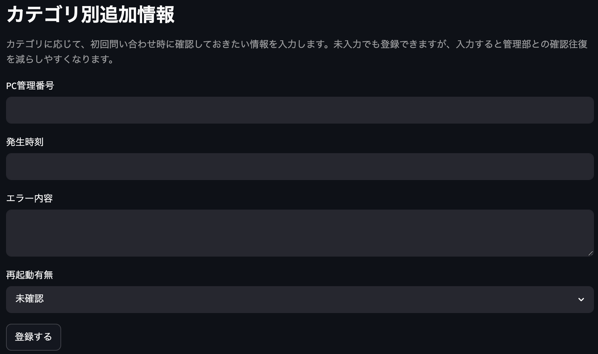

### ステータス更新

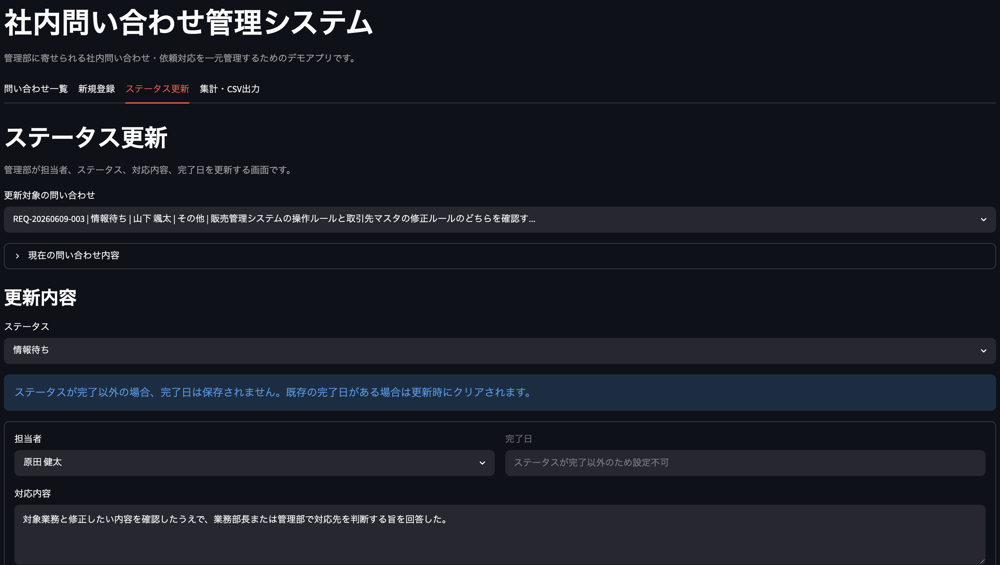

### FAQ候補管理

完了済み問い合わせの中から、よくある問い合わせとしてFAQ化できそうなものを候補登録します。FAQタイトル・回答案を保存し、CSV出力できます。

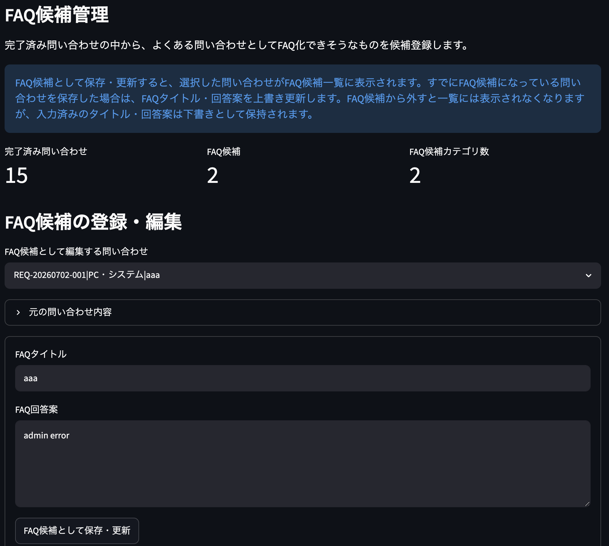

### 依頼者向け確認

問い合わせIDまたは依頼者名で検索し、依頼者が自分の問い合わせ状況を確認できる画面です。Ver.2ではデモ画面として実装しています。

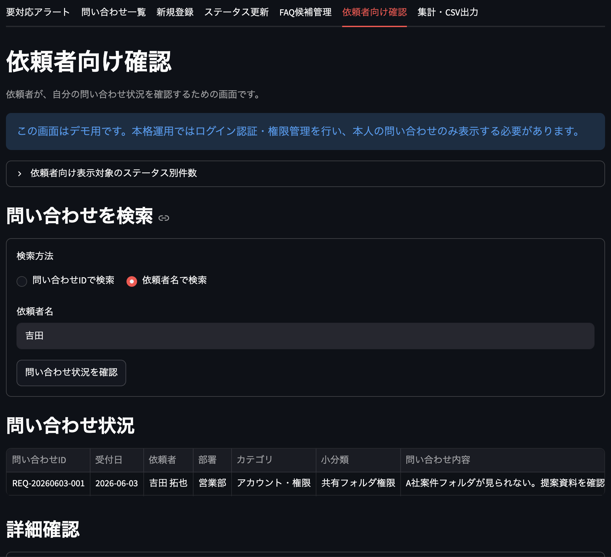

### 集計・CSV出力

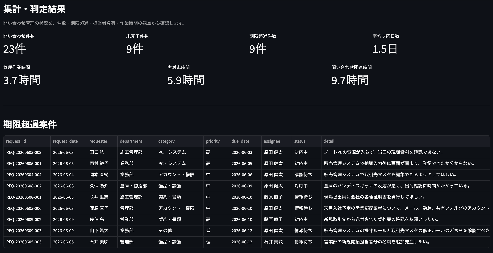
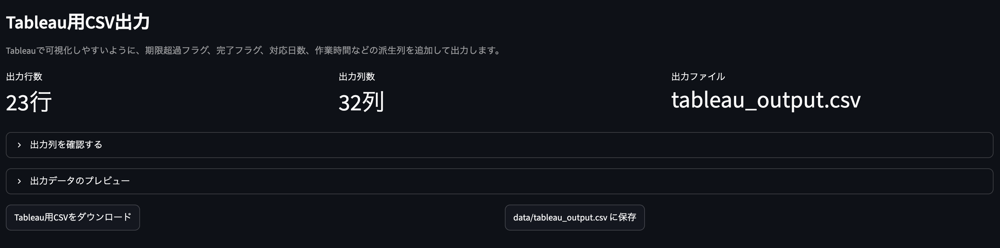

アラート件数、FAQ候補件数、追加情報入力率、依頼者向け表示件数などを集計します。

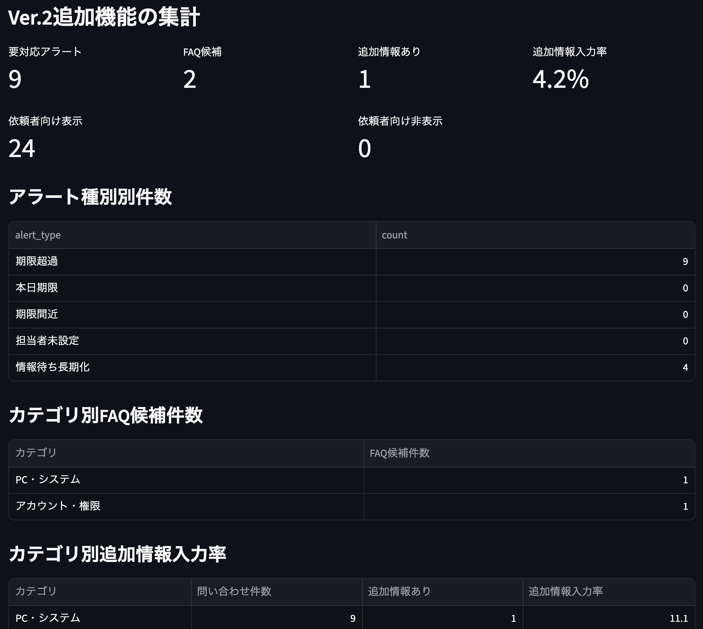

### Tableauダッシュボード

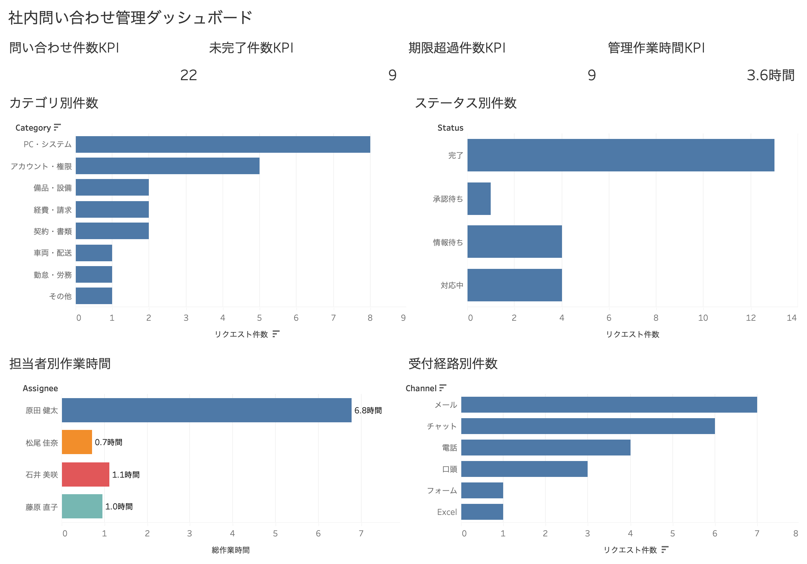

Ver.2では、要対応アラート、FAQ候補、追加情報入力率、依頼者向け表示件数などをTableau用CSVに追加しています。

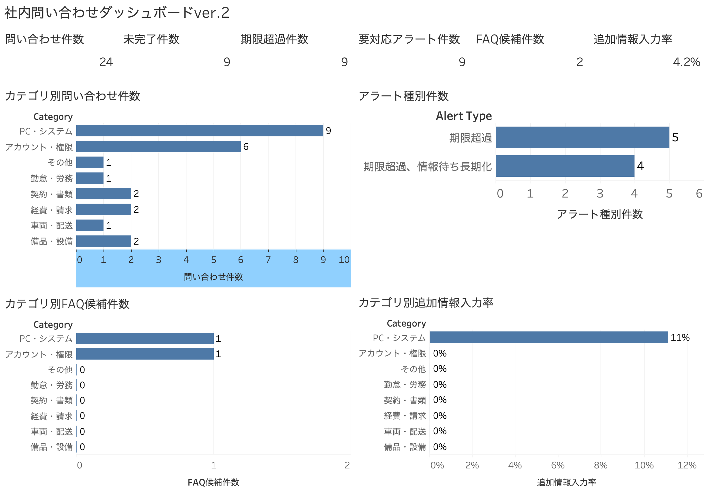

## 技術構成

| 技術      | 用途                         | 選定理由                                                                 |
| --------- | ---------------------------- | ------------------------------------------------------------------------ |
| Python    | データ処理、DB操作、集計処理 | CSV処理、DB操作、集計処理を一貫して実装しやすいため                      |
| pandas    | CSV読込、データ加工、集計    | 問い合わせデータの加工、集計、日付処理に適しているため                   |
| SQLite    | 問い合わせデータの保存       | 小規模な社内業務アプリのデータ保存に適しており、環境構築が容易なため     |
| Streamlit | 問い合わせ管理画面           | Pythonだけで簡易的な業務画面を作成でき、プロトタイプ開発に向いているため |
| Tableau   | ダッシュボード作成           | 管理者向けのダッシュボード作成、視覚的な報告に適しているため             |
| CSV       | Tableau連携、データ出力      | Tableau連携やバックアップ、外部確認に使いやすいため                      |
| Git       | バージョン管理               | バージョン管理とポートフォリオ公開のため                                 |

## フォルダ構成

```text
inquiry-dx-system/
├── app.py
├── schema.sql
├── requirements.txt
├── README.md
├── config/
│   ├── departments.csv
│   ├── categories.csv
│   ├── assignees.csv
│   ├── status_master.csv
│   ├── channels.csv
│   └── priorities.csv
├── data/
│   └── inquiry_dx_before_sample.csv
├── docs/
│   ├── requirements.md
│   ├── workflow.md
│   ├── screen_design.md
│   ├── data_definition.md
│   ├── KPI_definition.md
│   ├── operation_manual.md
│   ├── maintenance_manual.md
│   ├── test_checklist.md
│   ├── test_report.md
│   ├── effect_summary.md
│   ├── future_work.md
│   └── ver2/
│       ├── ver2_requirements.md
│       ├── ver2_screen_design.md
│       ├── ver2_data_definition.md
│       ├── ver2_wbs.md
│       ├── ver2_test_checklist.md
│       ├── ver2_release_note.md
│       └── ver2_portfolio_summary.md
├── notes/
│   └── ver2/
├── src/
│   ├── __init__.py
│   ├── db.py
│   ├── import_csv.py
│   ├── migrate_db.py
│   ├── aggregation.py
│   ├── summary.py
│   ├── alerts.py
│   ├── faq.py
│   ├── category_fields.py
│   ├── requester_view.py
│   ├── master_data.py
│   ├── tableau_export.py
│   ├── export_tableau_csv.py
│   ├── check_db.py
│   ├── check_alerts.py
│   ├── check_faq.py
│   ├── check_ver2_summary.py
│   ├── smoke_test.py
│   └── smoke_test_ver2.py
├── screenshots/
└── tableau/
```

## セットアップ

```bash
python3 -m venv .venv
source .venv/bin/activate
pip install -r requirements.txt
```

## 初期データ作成・DB移行

```bash
python -m src.import_csv
python -m src.migrate_db
python -m src.check_db
```

## アプリ起動

```bash
streamlit run app.py
```

## 動作確認

```bash
python -m py_compile app.py src/*.py
python -m src.check_db
python -m src.smoke_test
python -m src.smoke_test_ver2
python -m src.export_tableau_csv
python -m src.check_alerts
python -m src.check_faq
python -m src.check_ver2_summary
```

## Tableau用CSV出力

Streamlit画面の「集計・CSV出力」タブからCSVを出力できます。
ターミナルから出力する場合は以下です。

```bash
python -m src.export_tableau_csv
```

出力先は以下です。

```text
data/tableau_output.csv
```

## テスト

簡易スモークテストを実行できます。

```bash
python -m src.smoke_test
```

Ver.2追加機能のスモークテストは以下です。

```bash
python -m src.smoke_test_ver2
```

Tableau用CSV出力の確認は以下です。

```bash
python -m src.export_tableau_csv
```

手動テスト項目は以下に整理しています。

```bash
docs/test_checklist.md
docs/ver2/ver2_test_checklist.md
```

## Googleフォームとの違い

問い合わせ受付だけであれば、GoogleフォームとGoogleスプレッドシートでも対応可能です。
ただし、本プロジェクトでは受付だけでなく、以下まで対象としたため、StreamlitとSQLiteを用いた簡易業務アプリとして実装しました。

- 担当者設定
- ステータス更新
- 対応内容の記録
- 期限超過判定
- 対応日数計算
- 作業時間集計
- 要対応アラート
- FAQ候補管理
- カテゴリ別入力フォーム
- 依頼者向け確認
- Tableau連携用CSV出力

つまり、本システムは「問い合わせ受付フォーム」ではなく、「問い合わせ管理業務全体を支援する簡易システム」として位置づけています。

## Ver.2関連ドキュメント

Ver.2.0.0の設計・実装・テスト内容は、以下のドキュメントに整理しています。

| ドキュメント                          | 内容                        |
| ------------------------------------- | --------------------------- |
| `docs/ver2/ver2_requirements.md`      | Ver.2要件定義               |
| `docs/ver2/ver2_screen_design.md`     | Ver.2画面設計               |
| `docs/ver2/ver2_data_definition.md`   | Ver.2データ定義             |
| `docs/ver2/ver2_wbs.md`               | Ver.2開発タスク             |
| `docs/ver2/ver2_test_checklist.md`    | Ver.2テストチェックリスト   |
| `docs/ver2/ver2_release_note.md`      | Ver.2変更点まとめ           |
| `docs/ver2/ver2_portfolio_summary.md` | Ver.2ポートフォリオ向け要約 |

## 実装対象外

Ver.2では、問い合わせ管理業務の効率化に加えて、要対応アラート、FAQ候補管理、カテゴリ別入力フォーム、依頼者向け確認画面を実装しました。
一方で、本格運用に向けては以下を今後の課題としています。

| 対象外・発展課題 | 理由                                                   |
| ---------------- | ------------------------------------------------------ |
| ログイン認証     | Ver.2ではデモ画面として実装しており、本人確認は未実装  |
| 権限管理         | 依頼者、管理部、管理者で表示範囲を分ける必要がある     |
| メール通知       | ステータス変更・期限前通知は今後の拡張対象             |
| Slack連携        | 社内通知との連携は今後の拡張対象                       |
| FAQ公開ページ    | Ver.2ではFAQ候補管理までを対象とし、公開ページは未実装 |
| FAQ検索          | FAQ候補を検索・公開する仕組みは今後の課題              |
| 添付ファイル     | スクリーンショットや証憑資料の添付は未実装             |
| 操作履歴         | 誰がいつ更新したかの履歴管理は未実装                   |
| AI自動分類       | データ量が少ない段階では対象外                         |
| 本格承認フロー   | 仕様が複雑化するためVer.2では対象外                    |

## 今後の発展課題

- ログイン認証
- 担当者別権限管理
- 依頼者、管理部、管理者のロール分離
- FAQ公開ページ
- FAQ検索
- メール通知
- Slack連携
- 期限前リマインド
- 添付ファイル対応
- 対応履歴の詳細管理
- 操作履歴の記録
- PostgreSQLへの移行
- Flask / Django / FastAPIなどを用いたWebアプリ化
- GoogleフォームやGoogle Workspaceとの連携
- kintone、AppSheetなどのノーコードツールとの比較検討

## 学習・ポートフォリオ上のポイント

本プロジェクトでは、以下を示すことを意識しました。

- 業務課題を整理する力
- 要件定義・画面設計・データ設計の基礎
- PythonによるCSV処理・集計処理
- SQLiteによる簡易DB管理
- Streamlitによる業務画面作成
- pandasによるデータ加工・集計
- Tableau連携用データ設計
- テストチェックリストによる動作確認
- DB移行処理の作成
- Ver.2追加機能の段階的な拡張
- 効果試算と発展課題の整理

## このプロジェクトで示したこと

本プロジェクトでは、単に画面を作るだけでなく、以下の流れを一通り実装しました。

1. 業務課題の整理
2. 要件定義
3. データ設計
4. SQLiteによるデータ管理
5. Streamlitによる管理画面作成
6. 期限超過・対応日数・作業時間の集計
7. 要対応アラートの実装
8. FAQ候補管理の実装
9. カテゴリ別入力フォームの実装
10. 依頼者向け確認画面の実装
11. Tableau用CSV出力
12. Tableauダッシュボードによる可視化
13. テストチェックリスト・保守手順書の作成
14. Ver.2スモークテストの作成

これにより、問い合わせ受付だけでなく、問い合わせ管理業務全体の効率化を想定した簡易DXアプリとして作成しています。
