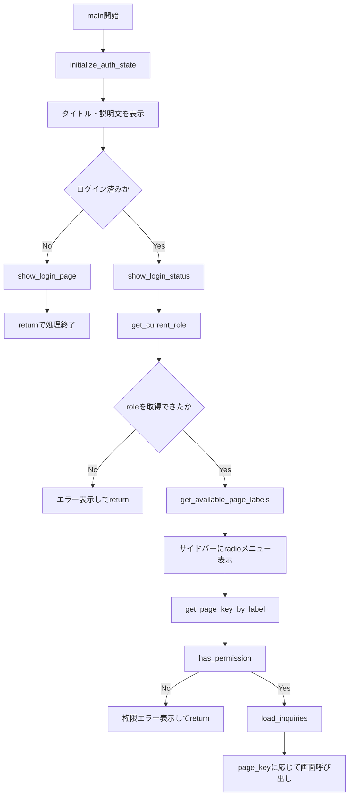
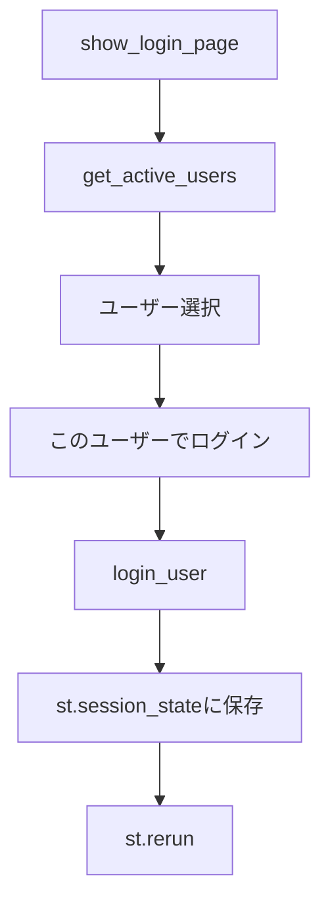
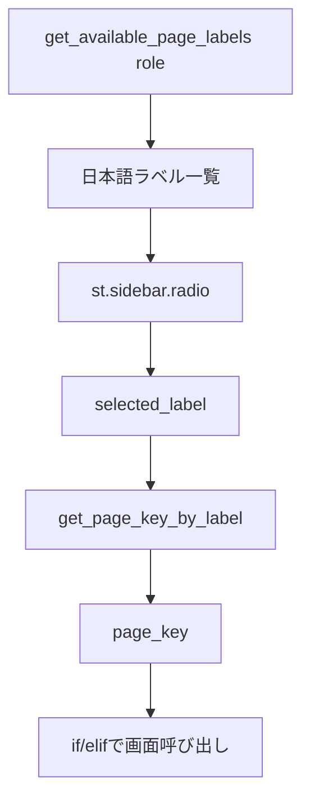
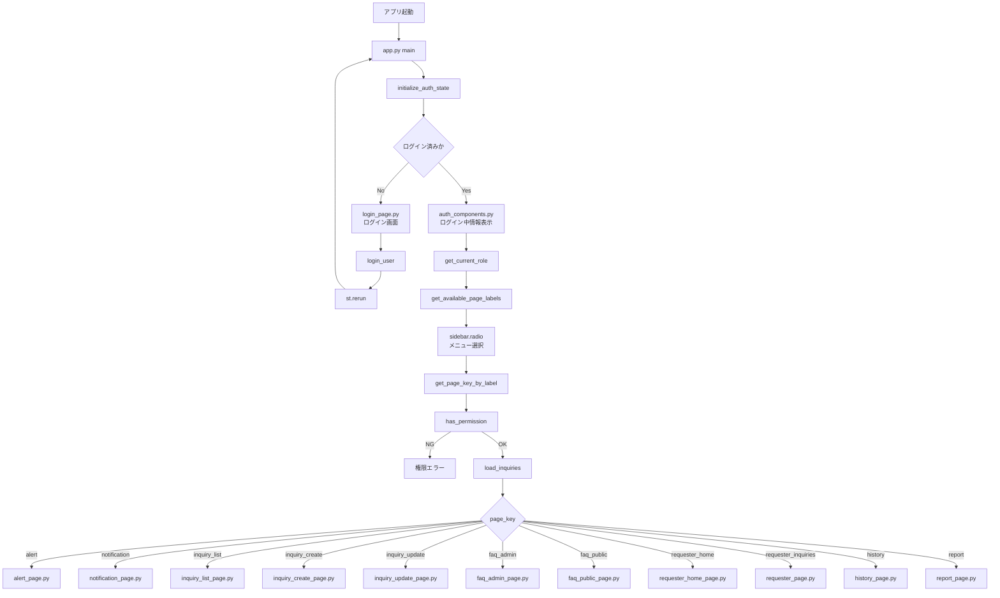

# `app.py` の役割理解と画面遷移

## 1. このノートの目的

このノートでは、社内問い合わせ管理システム Ver.3 における `app.py` の役割と、画面遷移の流れを整理する。

Ver.3では、WBS0で `app.py` の責務を軽くし、画面ごとの処理を `src/ui/` 配下へ分離した。
そのため、現在の `app.py` は「すべての画面処理を書くファイル」ではなく、**アプリ全体の入口・ログイン制御・画面振り分けを担当するファイル**になっている。

---

## 2. `app.py` の位置づけ

現在の全体構造における `app.py` の位置づけは以下である。

```text
app.py
  ↓
認証・ロール確認
  ↓
ロール別メニュー表示
  ↓
選択された画面を判定
  ↓
src/ui/*.py の show_xxx_page() を呼び出す
```

つまり、`app.py` はアプリの入口であり、各機能の本体ではない。

---

## 3. `app.py` が担当すること

`app.py` の主な責務は以下である。

| 責務                     | 内容                                                                  |
| ------------------------ | --------------------------------------------------------------------- |
| Streamlit画面設定        | ページタイトルやレイアウトを設定する                                  |
| 問い合わせデータ読み込み | SQLiteから問い合わせデータを取得し、派生列を追加する                  |
| ログイン状態初期化       | `st.session_state` にログイン状態の初期値を用意する                   |
| 未ログイン時の制御       | 未ログインならログイン画面だけを表示して処理を止める                  |
| ログイン中ユーザー表示   | サイドバーにログイン中ユーザー情報を表示する                          |
| ロール取得               | 現在ログイン中のユーザーのロールを取得する                            |
| ロール別メニュー表示     | requester / staff / admin / viewer ごとに利用可能な画面だけを表示する |
| 権限チェック             | 選択されたページを現在ロールで利用できるか確認する                    |
| 画面呼び出し             | `page_key` に応じて `show_xxx_page()` を呼び出す                      |

---

## 4. `app.py` が担当しないこと

逆に、`app.py` が担当しないことも重要である。

| 担当しないこと               | 実際の担当                                             |
| ---------------------------- | ------------------------------------------------------ |
| ログイン処理の詳細           | `src/services/auth_service.py`, `src/ui/login_page.py` |
| ロール別ページ定義           | `src/services/auth_service.py`                         |
| 各画面のフォーム表示         | `src/ui/*.py`                                          |
| FAQ検索・保存判断            | `src/services/faq_service.py`                          |
| 依頼者本人の問い合わせ抽出   | `src/services/requester_service.py`                    |
| コメント・履歴・操作ログ保存 | `src/services/history_service.py`                      |
| 通知対象抽出・通知文生成     | `src/services/notification_service.py`                 |
| SQL実行                      | `src/db.py`                                            |
| 集計処理                     | `src/summary.py`, `src/aggregation.py`                 |
| Tableau用CSV作成             | `src/tableau_export.py`                                |

`app.py` に処理を書きすぎると、画面追加のたびに肥大化する。そのため、Ver.3では `app.py` を「交通整理役」に近づけている。

---

## 5. `app.py` の基本構成

現在の `app.py` は、大きく以下の構成になっている。

```text
1. import
2. st.set_page_config()
3. load_inquiries()
4. main()
5. if __name__ == "__main__": main()
```

---

## 6. `import` の役割

`app.py` では、各画面を呼び出すために `src/ui/` 配下の関数をimportしている。
例として、以下のような関数を読み込んでいる。

```python
from src.ui.inquiry_create_page import show_inquiry_create_page
from src.ui.inquiry_update_page import show_inquiry_update_page
from src.ui.alert_page import show_alert_page
from src.ui.faq_admin_page import show_faq_admin_page
from src.ui.inquiry_list_page import show_inquiry_list_page
from src.ui.requester_page import show_requester_page
from src.ui.report_page import show_report_page
from src.ui.faq_public_page import show_faq_public_page
from src.ui.requester_home_page import show_requester_home_page
from src.ui.history_page import show_history_page
from src.ui.notification_page import show_notification_page
```

これらは、実際の画面本体である。`app.py` はそれらを呼び出すだけで、画面の中身までは持たない。

また、認証・ロール制御のために以下をimportしている。

```python id="pfmdlk"
from src.services.auth_service import (
    get_available_page_labels,
    get_current_role,
    get_page_key_by_label,
    has_permission,
    initialize_auth_state,
    is_logged_in,
)
```

ここから分かるように、ロール別メニューや権限判定は `app.py` に直接書かず、`auth_service.py` に分離している。

---

## 7. `st.set_page_config()` の役割

`st.set_page_config()` は、Streamlitアプリ全体の表示設定を行う。

```python
st.set_page_config(
    page_title="社内問い合わせ管理システム",
    layout="wide",
)
```

この設定により、ブラウザタブのタイトルや画面レイアウトが決まる。

| 設定            | 内容                             |
| --------------- | -------------------------------- |
| `page_title`    | ブラウザタブに表示されるタイトル |
| `layout="wide"` | 横幅を広く使うレイアウト         |

業務アプリでは一覧表や集計表を表示するため、`wide` にしているのは自然である。

---

## 8. `load_inquiries()` の役割

`load_inquiries()` は、問い合わせデータをSQLiteから読み込み、画面表示で使いやすいDataFrameに整える関数である。

処理の流れは以下である。

```text
init_db()
  ↓
fetch_all_inquiries()
  ↓
rowsが空なら空のDataFrameを返す
  ↓
rowsをpandas DataFrameに変換
  ↓
add_derived_columns(df)
  ↓
加工済みDataFrameを返す
```

コード上は、おおよそ以下の役割を持つ。

```python
@st.cache_data(ttl=10)
def load_inquiries() -> pd.DataFrame:
    init_db()
    rows = fetch_all_inquiries()

    if not rows:
        return pd.DataFrame()

    df = pd.DataFrame(rows)
    df = add_derived_columns(df)

    return df
```

### 8.1 `init_db()`

`init_db()` は、DB初期化を行う。`schema.sql` に基づいて必要なテーブルを作る処理である。
`load_inquiries()` の中で `init_db()` を呼ぶことで、アプリ起動時にDBが未作成でも最低限の初期化が行われる。

---

### 8.2 `fetch_all_inquiries()`

`fetch_all_inquiries()` は、SQLiteから問い合わせ一覧を取得するDB関数である。
取得結果は、最初はPythonの辞書リストに近い形で返る。それを `pd.DataFrame(rows)` でDataFrameに変換する。

---

### 8.3 `add_derived_columns()`

`add_derived_columns(df)` は、画面表示や集計に使う派生列を追加する処理である。たとえば、以下のような列がここで整えられる。

```text
期限超過判定、期限までの日数、日付型変換、表示用の補助列
```

つまり、DBから取得した生データを、そのまま画面に渡すのではなく、アプリで扱いやすい形にしてから各画面へ渡している。

---

### 8.4 `@st.cache_data(ttl=10)`

`@st.cache_data(ttl=10)` は、Streamlitのキャッシュである。意味は、同じ処理結果を一定時間再利用すること。`ttl=10` なので、10秒間は同じデータを再利用する。

問い合わせ一覧は多くの画面で使われるため、毎回DBから読み直すのではなく、短時間キャッシュすることで画面表示を軽くしている。
ただし、新規登録や更新後は最新データを読み直す必要がある。そのため、各UIでは `clear_cache()` を呼び、キャッシュを消してから再表示する処理が入っている。

---

## 9. `main()` の役割

`main()` は、アプリ全体のメイン処理である。

大まかな流れは以下である。



`main()` は、以下の順で処理を進める。

```text
1. ログイン状態の初期化
2. タイトル・説明文の表示
3. 未ログインならログイン画面を表示して終了
4. ログイン済みならサイドバーにログイン中ユーザー情報を表示
5. 現在ロールを取得
6. ロールに応じたメニューを表示
7. 選択されたメニュー名をpage_keyに変換
8. 権限チェック
9. 問い合わせデータを読み込む
10. page_keyに応じて各画面を呼び出す
```

---

## 10. ログイン前後の画面遷移

### 10.1 未ログイン時

#### 画面

|  |
| :---------------------------------------------------------------------: |

#### ソースコード

```python
def main() -> None:
    initialize_auth_state() ...1

    st.title("社内問い合わせ管理システム")
    st.caption("管理部に寄せられる社内問い合わせ・依頼対応を一元管理するためのデモアプリです。")

    if not is_logged_in():
        show_login_page() ...2
        return
    ...
```

<details>
<summary>ソースコードの詳細</summary>

```python
# 1. initialize_auth_state() from src.services.auth_service
# "is_logged_in"が定義されていないとき、"is_logged_in"をFalseにする
def initialize_auth_state() -> None:
    st.session_state.setdefault("is_logged_in", False)
    ...
```

```python
# show_login_page() from src.ui.login_page
def show_login_page() -> None:
    st.header("ログイン")
    st.info("Ver.3では、ポートフォリオ用の簡易ログインとして、ユーザー選択式でロール別表示を確認します。")

    users = get_active_users() ...2-1

    if not users:
        st.error("ログイン可能なユーザーが登録されていません。")
        st.caption("先に python -m src.check_db を実行して初期ユーザーを登録してください。")
        return

    # 例: {山田 太郎 (営業部 / requester) : U001}
    user_options = {
        f'{user["user_id"]}: {user["user_name"]}（{user["department"]} / {user["role"]}）': user["user_id"]
        for user in users
    }

    id_to_user = {
        user["user_id"]: user
        for user in users
    }

    selected_label = st.selectbox("ログインユーザー", list(user_options.keys()),)

    # selected_labelで選択した人物のvalueをとる
    selected_user_id = user_options[selected_label]
    selected_user = id_to_user.get(selected_user_id)

    st.markdown("### 選択中ユーザー")
    st.write(f'ユーザーID: {selected_user["user_id"]}')
    st.write(f'氏名: {selected_user["user_name"]}')
    st.write(f'部署: {selected_user["department"]}')
    st.write(f'ロール: {selected_user["role"]}')

    if st.button("このユーザーでログイン", type="primary"):
        try:
            login_user(selected_user_id) ...2-2
        except ValueError as error:
            st.error(str(error))
            return

        st.rerun()
```

```python
# 2-1. get_active_users() from src.services.auth_service
# 有効なユーザー(is_active=1)をusersテーブルから全て取得する
def get_active_users() -> list[dict[str, Any]]:
    return fetch_active_users()

def fetch_active_users() -> list[dict[str, Any]]:
    sql = """SELECT * FROM users WHERE is_active = 1 ORDER BY user_id"""
    with get_connection() as conn:
        rows = conn.execute(sql).fetchall()
    return [dict(row) for row in rows]
```

`get_active_users()`を実行することで、以下の`users`テーブル(8列)に基づいた`list[dict]`が取得される

| user_id | user_name | department | email                   | role      | is_active | created_at          | updated_at          |
| ------- | --------- | ---------- | ----------------------- | --------- | --------- | ------------------- | ------------------- |
| U001    | 山田 太郎 | 営業部     | `yamada@example.com`    | requester | 1         | 2026-07-07 14:13:46 | 2026-07-07 14:13:46 |
| U002    | 佐藤 花子 | 管理部     | `sato@example.com`      | staff     | 1         | 2026-07-07 14:13:46 | 2026-07-07 14:13:46 |
| U003    | 鈴木 一郎 | 管理部     | `suzuki@example.com`    | admin     | 1         | 2026-07-07 14:13:46 | 2026-07-07 14:13:46 |
| U004    | 高橋 美咲 | 経営企画部 | `takahashi@example.com` | viewer    | 1         | 2026-07-07 14:13:46 | 2026-07-07 14:13:46 |

```python
# list[dict]
users = [
    {"user_id": "U001", "user_name": "山田 太郎", "department": "営業部", "role": "requester", ...},
    {"user_id": "U002", "user_name": "佐藤 花子", "department": "管理部", "role": "staff", ...},
    ...
]
```

```python
# 2-2. login_user() from src.services.auth_service
def login_user(user_id: str) -> None:
    """指定ユーザーでログインする。"""
    #userは{"user_id": "U001", "user_name": "山田 太郎",...}の形で返ってくる
    user = fetch_user_by_id(user_id)

    if user is None:
        raise ValueError(f"ユーザーが見つかりません: {user_id}")

    if int(user.get("is_active", 0)) != 1:
        raise ValueError(f"無効なユーザーです: {user_id}")

    st.session_state["is_logged_in"] = True
    # 他の画面でも情報を使いたいため、current_userをuserとしている
    st.session_state["current_user"] = user
    st.session_state["current_role"] = user["role"]

def fetch_user_by_id(user_id: str) -> dict[str, Any] | None:
    """user_idを指定してユーザーを1件取得する。"""
    sql = """SELECT * FROM users WHERE user_id = ?"""
    with get_connection() as conn:
        row = conn.execute(sql, (user_id,)).fetchone()
    return dict(row) if row else None
```

</details>

未ログイン時は、問い合わせ一覧やFAQ画面などは表示されない。

```text
app.py
  ↓
initialize_auth_state()
  ↓
is_logged_in() == False
  ↓
show_login_page()
  ↓
return
```

この `return` が重要である。ログインしていない場合、`show_login_page()` を表示した後に `return` するため、その下のメニュー表示や画面呼び出し処理には進まない。

---

### 10.2 ログイン処理

ログイン画面では、ユーザー一覧からログインユーザーを選択する。



`login_user()` により、以下が `st.session_state` に保存される。

| session_stateキー | 内容                       |
| ----------------- | -------------------------- |
| `is_logged_in`    | ログイン済みか             |
| `current_user`    | ログイン中ユーザー情報     |
| `current_role`    | ログイン中ユーザーのロール |

その後 `st.rerun()` により、アプリが再実行される。再実行後は `is_logged_in()` が `True` になるため、ログイン後画面へ進む。

---

### 10.3 ログイン後

ログイン後は、サイドバーにログイン中ユーザー情報とメニューが表示される。

```python
def main() -> None:
    initialize_auth_state()
    ...

    show_login_status()
    ...
```

```python
def show_login_status() -> None:
    user = get_current_user()

    if user is None:
        return

    st.sidebar.markdown("### ログイン中")
    st.sidebar.write(f'氏名: {user["user_name"]}')
    st.sidebar.write(f'部署: {user["department"]}')
    st.sidebar.write(f'ロール: {user["role"]}')

    if st.sidebar.button("ログアウト"):
        logout_user()
        st.rerun()

def get_current_user() -> dict[str, Any] | None:
    return st.session_state.get("current_user")
```

```text
show_login_status()
  ↓
サイドバーに氏名・部署・ロールを表示
  ↓
ロール別メニューを表示
```

`show_login_status()` では、ログアウトボタンも表示される。ログアウトすると `logout_user()` が呼ばれ、`st.session_state` のログイン情報がクリアされる。

---

## 11. ロール別メニューの仕組み

```python
def main() -> None:
    initialize_auth_state()
    ...

    role = get_current_role()
    if role is None:
        st.error("ロール情報を取得できません。再ログインしてください。")
        return

    # role=requesterなら、"依頼者トップ"などが返ってくる
    page_labels = get_available_page_labels(role)
    selected_label = st.sidebar.radio("メニュー", page_labels)

    # "依頼者トップ"が選択された場合、"requester_home"が返ってくる
    page_key = get_page_key_by_label(role, selected_label)
    ...
```

<details>
<summary>ソースコードの詳細</summary>

```python
#1
def get_current_role() -> str | None:
    return st.session_state.get("current_role")

#2
def get_available_page_labels(role: str) -> list[str]:
    return [PAGE_CONFIGS[key]["label"] for key in get_available_page_keys(role)]
def get_available_page_keys(role: str) -> list[str]:
    return ROLE_PAGES.get(role, [])

PAGE_CONFIGS: dict[str, PageConfig] = {
    "requester_home": {"label": "依頼者トップ", "role_group": "requester",},
    "faq_public": {"label": "FAQ検索", "role_group": "shared",},
    ...
}
ROLE_PAGES: dict[str, list[str]] = {
    "requester": ["requester_home", "faq_public", "inquiry_create", "requester_inquiries",],
    ...
}
#3
def get_page_key_by_label(role: str, label: str) -> str:
    """ページ表示名からページキーを取得する。"""
    for key in get_available_page_keys(role):
        if PAGE_CONFIGS[key]["label"] == label:
            return key

    raise ValueError(f"利用できないページです: {label}")
```

</details>

ロール別メニューは、`auth_service.py` の `ROLE_PAGES` で定義されている。現在のロールは以下の4種類である。

| ロール      | 意味               |
| ----------- | ------------------ |
| `requester` | 依頼者             |
| `staff`     | 管理部担当者       |
| `admin`     | 管理者             |
| `viewer`    | 閲覧者・集計確認者 |

---

### 11.1 requester のメニュー

```text
requester:
  - 依頼者トップ
  - FAQ検索
  - 新規登録
  - 自分の問い合わせ
```

依頼者は、自分で問い合わせを登録し、自分の問い合わせ状況を確認するロールである。管理部向けの問い合わせ一覧や更新画面、履歴確認画面、通知対象確認画面は表示されない。

---

### 11.2 staff のメニュー

```text id="5z6nfp"
staff:
  - 要対応アラート
  - 通知対象確認
  - 問い合わせ一覧
  - ステータス更新
  - FAQ候補管理
  - FAQ検索
  - 新規登録
```

staffは、問い合わせ対応を行う管理部担当者である。問い合わせ一覧、ステータス更新、FAQ管理、通知対象確認などを使える。
ただし、admin専用の履歴確認画面や集計・CSV出力画面は含まれていない。

---

### 11.3 admin のメニュー

```text
admin:
  - 要対応アラート
  - 通知対象確認
  - 問い合わせ一覧
  - ステータス更新
  - FAQ候補管理
  - FAQ検索
  - 新規登録
  - 自分の問い合わせ
  - 履歴確認
  - 集計・CSV出力
```

adminは、staffの機能に加えて、履歴確認や集計・CSV出力を使える。Ver.3では、全体管理・監査確認・ポートフォリオ評価向けの画面はadminに寄せている。

---

### 11.4 viewer のメニュー

```text
viewer:
  - 集計・CSV出力
```

viewerは、集計結果やCSV出力だけを見るロールである。問い合わせの作成・更新・FAQ管理・通知確認などは使えない。

---

## 12. `page_label` と `page_key`

画面遷移で重要なのが、`page_label` と `page_key` の違いである。

| 用語         | 意味                       | 例               |
| ------------ | -------------------------- | ---------------- |
| `page_key`   | プログラム内部で使う識別子 | `inquiry_list`   |
| `page_label` | 画面に表示する日本語名     | `問い合わせ一覧` |

ユーザーには日本語の `page_label` を表示する。しかし、内部処理では英語の `page_key` を使って分岐する。

流れは以下である。



例として、staffが「問い合わせ一覧」を選んだ場合は以下のようになる。

```text
selected_label = "問い合わせ一覧"
  ↓
get_page_key_by_label("staff", "問い合わせ一覧")
  ↓
page_key = "inquiry_list"
  ↓
show_inquiry_list_page(df)
```

---

## 13. 権限チェックの流れ

ロール別メニューで表示しているため、基本的には権限外の画面は選べない。しかし、プログラム上の安全策として、選択後にも `has_permission()` で確認している。

```python
if not has_permission(page_key, role):
    st.error("この画面を利用する権限がありません。")
    return
```

これにより、何らかの理由で不正な `page_key` が入った場合でも、権限外の画面を表示しない。権限チェックの考え方は以下である。

```text
現在ロールを取得
  ↓
そのロールのROLE_PAGESを取得
  ↓
page_keyが含まれているか確認
  ↓
含まれていなければエラー
```

---

## 14. page_keyごとの画面呼び出し

`app.py` の最後では、`page_key` に応じて各画面を呼び出している。

```text
if page_key == "alert":
    show_alert_page(df)
elif page_key == "notification":
    show_notification_page(df)
elif page_key == "inquiry_list":
    show_inquiry_list_page(df)
elif page_key == "inquiry_create":
    show_inquiry_create_page()
elif page_key == "inquiry_update":
    show_inquiry_update_page(df)
elif page_key == "faq_admin":
    show_faq_admin_page(df)
elif page_key == "requester_inquiries":
    show_requester_page(df)
elif page_key == "report":
    show_report_page(df)
elif page_key == "requester_home":
    show_requester_home_page(df)
elif page_key == "history":
    show_history_page(df)
elif page_key == "faq_public":
    show_faq_public_page()
else:
    st.error(...)
```

ここで分かるように、ほとんどの画面には `df` が渡される。`df` は `load_inquiries()` で取得した問い合わせ一覧DataFrameである。
一方で、以下の画面には `df` を渡していない。

```text
show_inquiry_create_page()
show_faq_public_page()
```

理由は以下である。

| 画面                         | dfを受け取らない理由                                                                   |
| ---------------------------- | -------------------------------------------------------------------------------------- |
| `show_inquiry_create_page()` | 新規登録画面なので、既存問い合わせ一覧全体は必須ではない                               |
| `show_faq_public_page()`     | FAQ検索は `faq_service` 経由で公開FAQを取得するため、問い合わせ一覧DataFrameを使わない |

---

## 15. 画面遷移全体図

現在の画面遷移を全体図にすると以下のようになる。



---

## 16. 画面ごとのデータの渡し方

各画面へのデータの渡し方は以下である。

| page_key              | 呼び出される関数               | dfを渡すか | 主な用途                         |
| --------------------- | ------------------------------ | ---------: | -------------------------------- |
| `alert`               | `show_alert_page(df)`          |       あり | 要対応アラート表示               |
| `notification`        | `show_notification_page(df)`   |       あり | 通知対象抽出・通知文生成         |
| `inquiry_list`        | `show_inquiry_list_page(df)`   |       あり | 問い合わせ一覧表示               |
| `inquiry_create`      | `show_inquiry_create_page()`   |       なし | 新規問い合わせ登録               |
| `inquiry_update`      | `show_inquiry_update_page(df)` |       あり | ステータス・担当者・対応内容更新 |
| `faq_admin`           | `show_faq_admin_page(df)`      |       あり | FAQ候補管理・公開FAQ管理         |
| `faq_public`          | `show_faq_public_page()`       |       なし | 公開FAQ検索                      |
| `requester_home`      | `show_requester_home_page(df)` |       あり | 依頼者トップ表示                 |
| `requester_inquiries` | `show_requester_page(df)`      |       あり | 自分の問い合わせ表示             |
| `history`             | `show_history_page(df)`        |       あり | 履歴確認                         |
| `report`              | `show_report_page(df)`         |       あり | 集計・CSV出力                    |

`df` を受け取る画面は、問い合わせ一覧をもとに表示・絞り込み・集計を行う画面である。
`df` を受け取らない画面は、独自にDBやサービス層から必要データを取得する画面である。

---

## 17. `app.py` と `auth_service.py` の関係

`app.py` は、ロール別メニューの具体的な中身を自分では持たない。その代わり、`auth_service.py` の以下を使う。

| 関数                                 | 役割                                 |
| ------------------------------------ | ------------------------------------ |
| `initialize_auth_state()`            | ログイン状態の初期値を設定           |
| `is_logged_in()`                     | ログイン済みか判定                   |
| `get_current_role()`                 | 現在ロールを取得                     |
| `get_available_page_labels(role)`    | ロールに応じた表示用メニュー名を取得 |
| `get_page_key_by_label(role, label)` | 表示名から内部キーへ変換             |
| `has_permission(page_key, role)`     | そのロールでページを使えるか判定     |

この分離により、画面を追加するときは以下の作業になる。

```text
1. src/ui/xxx_page.py を作る
2. app.py で show_xxx_page をimportする
3. app.py の if/elif に page_key 分岐を追加する
4. auth_service.py の PAGE_CONFIGS に page_key と表示名を追加する
5. auth_service.py の ROLE_PAGES に表示したいロールへ追加する
```

つまり、画面追加時の変更箇所が明確になっている。

---

## 18. 新しい画面を追加するときの流れ

たとえば、将来 `dashboard` という画面を追加する場合、手順は以下になる。

### 18.1 UIファイルを作る

```text
src/ui/dashboard_page.py
```

```python
def show_dashboard_page(df):
    ...
```

### 18.2 `app.py`でimportする

```python
from src.ui.dashboard_page import show_dashboard_page
```

### 18.3 `app.py`の分岐に追加する

```python
elif page_key == "dashboard":
    show_dashboard_page(df)
```

### 18.4 `auth_service.py`の`PAGE_CONFIGS`に追加する

```python
"dashboard": {
    "label": "ダッシュボード",
    "role_group": "staff",
},
```

### 18.5 `ROLE_PAGES`に追加する

```python
"staff": [
    ...
    "dashboard",
],
```

このように、画面追加の流れは一定である。Ver.3ではこのパターンで、FAQ検索、依頼者トップ、履歴確認、通知対象確認などを追加している。

---

## 19. `app.py` を読むときのポイント

`app.py` を読むときは、細かい業務処理ではなく、以下を見ると理解しやすい。

```text
1. ログイン前にどこで止まるか
2. ログイン後にロールをどう取得するか
3. ロール別メニューをどこから取得するか
4. 表示ラベルをpage_keyへどう変換するか
5. 権限チェックをどこで行うか
6. 問い合わせデータをどこで読み込むか
7. page_keyごとにどのUI関数へ処理を渡すか
```

`app.py` は「業務処理の中身」ではなく、「アプリ全体の流れ」を読むファイルである。

---

## 20. `app.py` の設計上の良い点

現在の `app.py` には、以下の良い点がある。

| 良い点                           | 内容                                                         |
| -------------------------------- | ------------------------------------------------------------ |
| 画面ごとに処理が分離されている   | `src/ui/*.py` に画面処理を逃がしている                       |
| ロール制御が分離されている       | `auth_service.py` にページ定義と権限判定を集約している       |
| 未ログイン時に早期returnしている | ログイン前に他画面へ進まない                                 |
| `page_key` による分岐が明確      | どのメニューがどの画面に対応するか分かりやすい               |
| データ読み込みが一箇所にある     | `load_inquiries()` で問い合わせDataFrameをまとめて作っている |
| キャッシュを使っている           | 毎回DBを読み直さず、短時間キャッシュしている                 |

---

## 21. `app.py` の設計上の注意点

一方で、注意点もある。

| 注意点                                    | 内容                                                                  |
| ----------------------------------------- | --------------------------------------------------------------------- |
| 画面が増えるとif/elifが長くなる           | 小規模PoCでは問題ないが、大規模化するとルーティング辞書化も検討できる |
| `load_inquiries()` が全ページ前に呼ばれる | `df` を使わない画面でも、権限チェック後に読み込みが走る               |
| `auth_service.py` がStreamlit依存         | `st.session_state` を使うため、純粋な認証ロジックではない             |
| `page_label` 重複に弱い                   | 同じ日本語ラベルを複数ページに使うと変換が曖昧になる                  |
| 本格的なURLルーティングではない           | Streamlitのサイドバーメニューによる画面切替である                     |

現時点ではポートフォリオ用PoCなので、現在の構成で十分である。ただし、さらに画面数が増える場合は、以下のような改善も考えられる。

```python
PAGE_RENDERERS = {
    "alert": show_alert_page,
    "notification": show_notification_page,
    "inquiry_list": show_inquiry_list_page,
    ...
}
```

このようにすれば、長い `if/elif` を減らせる。ただし、無理に変更する必要はない。

---

## 22. WBS8との関係

WBS8では、集計・CSV出力の拡張を行う予定である。

そのとき、`app.py` 側で大きく触る可能性があるのは、主に以下である。

```text
show_report_page(df)
```

現在、集計・CSV出力画面は `page_key == "report"` のときに呼ばれる。

```python
elif page_key == "report":
    show_report_page(df)
```

WBS8で集計画面を拡張する場合も、基本的には `app.py` に集計処理を書くのではなく、以下を拡張する方針がよい。

```text
src/ui/report_page.py
src/summary.py
src/tableau_export.py
必要なら src/services/report_service.py
```

`app.py` は、引き続き `show_report_page(df)` を呼び出すだけに留めるのが望ましい。

---

## 23. まとめ

`app.py` は、Ver.3におけるアプリ全体の入口である。役割を一言で言うと、以下である。

```text
ログイン状態とロールを確認し、
利用可能なメニューを表示し、
選択された画面へ処理を振り分けるファイル
```

重要なのは、`app.py` が業務処理を直接持たないことである。
問い合わせ登録、FAQ管理、履歴保存、通知対象抽出、集計処理などは、それぞれ `src/ui/`、`src/services/`、`src/db.py`、`src/summary.py`、`src/tableau_export.py` に分離されている。

現在の設計では、画面追加時の基本パターンは以下である。

```text
UIファイルを作る
  ↓
app.pyでimportする
  ↓
app.pyのpage_key分岐に追加する
  ↓
auth_service.pyのPAGE_CONFIGSに追加する
  ↓
auth_service.pyのROLE_PAGESに追加する
```

この流れを理解しておけば、WBS8以降で画面や集計機能を追加するときにも、どこを触ればよいか判断しやすくなる。
